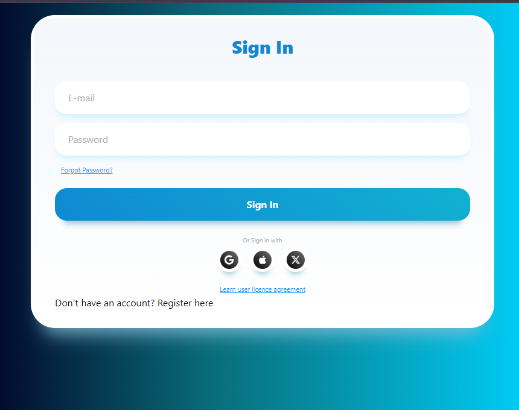
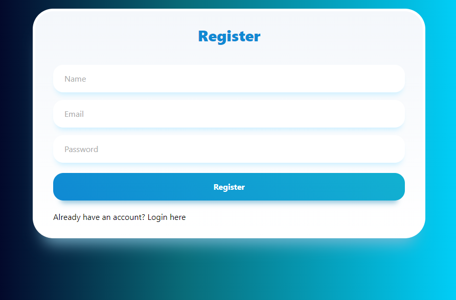
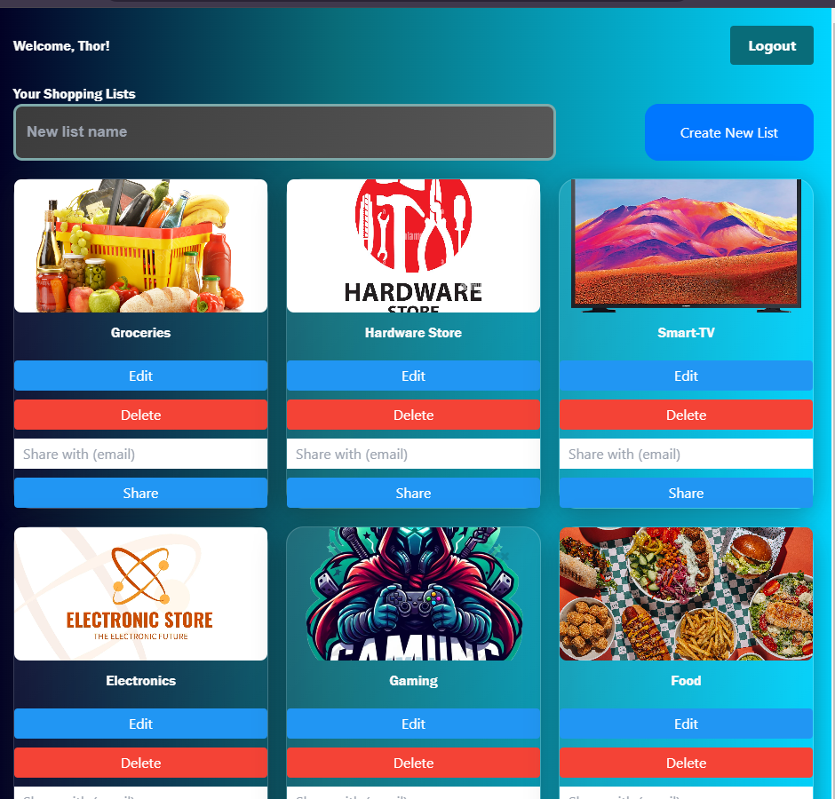

# Shopping List App with Redux

## Overview
This README outlines the development of a Shopping List App using Redux for state management. The app provides a user-friendly interface for managing shopping lists with full CRUD functionality, user authentication, and offline capabilities. The application is designed to help users organize their shopping efficiently.

## Objectives
1. **Redux Setup:**
   - Implement Redux for managing global application state to ensure consistency across components.

2. **CRUD Functionality:**
   - Enable users to Create, Read, Update, and Delete shopping list items easily.

3. **List Management:**
   - Display all shopping items in a list format, allowing users to interact with their items intuitively.

4. **Item Details:**
   - Include essential details for each item, such as:
     - **Name:** The name of the shopping item.
     - **Quantity:** The number of units required.
     - **Notes:** Optional additional information for each item.

5. **Categories or Tags:**
   - Allow users to categorize items (e.g., groceries, electronics) or assign tags for better organization and retrieval.

6. **Search Functionality:**
   - Implement a search bar to enable users to quickly locate specific items within their lists.

7. **Sorting and Filtering:**
   - Provide options to sort items alphabetically or by category, and to filter based on selected tags.

8. **Multiple Lists:**
   - Support the creation and management of multiple shopping lists for different purposes (e.g., groceries, household items, gifts).

9. **Sharing Lists:**
   - Allow users to share their shopping lists with family and friends via email or social media platforms.

10. **Offline Support:**
    - Ensure the app is usable offline, with the ability to sync data to the server when an internet connection is restored.

11. **Storage:**
    - Integrate JSON-Server to store shopping list data, allowing for persistent data management during development.

12. **Authentication:**
    - Implement user authentication to manage access to shopping lists securely.

13. **User Interface:**
    - Design a clean and intuitive user interface with easy navigation for adding, editing, and deleting items.

14. **Privacy & Security:**
    - Protect user data and privacy in accordance with relevant laws and regulations, including secure storage of user credentials.

## Installation
To set up the Shopping List App, follow these steps:

1. **Clone the repository:**
   ```bash
   git clone https://github.com/Cornel-MIT/Redux-App.git
   cd shopping-list-app

2. **Install dependencies:**
   ```bash
   npm install

3. **Ensure you have JSON-Server installed globally:**
   ```bash
   npm install -g json-server

4. **Start the JSON-Server with a sample database:**
   ```bash
   json-server --watch db.json --port 3001


## Images





